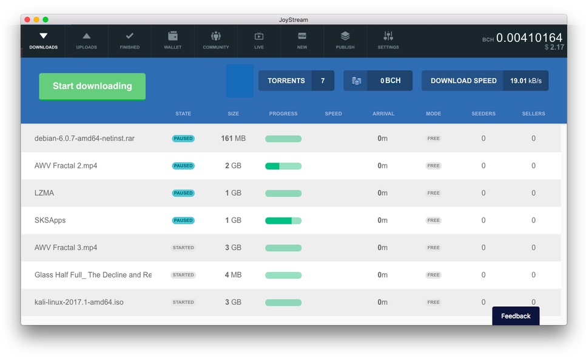

A BitTorrent client, with faster speeds, streaming and paid seeding.

###### Fast downloads
Joystream Classic rewards seeders for providing bandwidth with micropayments, and this leads to much higher download speeds on all content.

###### Streaming
Joystream Classic makes it possible to download and seek to any part of a large HD audio or video file by simply requesting and paying for it directly, which makes streaming work as well as on the web

###### More content
Joystream Classic gives anyone with a full download a reason to stick around and become a seeder, which radically improves content availability.

###### Paid seeding
Anyone with spare bandwith can use Joystream Classic and earn Bitcoin Cash, at what ever price they choose, in exchange for seeding to peers. If you have some rare content which no one else has, you are rewarded by being able to charge higher prices.


# Joystream - desktop client

This is the main Joystream Classic cross platform (electron) desktop application, which currently works on Windows, OSX and Linux/Debian distros.



## License

Joystream Classic Desktop is released under the terms of the MIT license.
See [LICENSE](LICENSE) for more information.

## Disclaimer

Joystream Classic is still in its early stages and may contain bugs. Use at your own risk.

## Download Binaries

You can download signed prebuilt binaries from the [Releases](https://github.com/Joystream/joystream-electron/releases) section.

## Building

To build the application from source you will need to have a development setup on your system. The tools required are:
- [git](https://git-scm.com/)
- [node-js](https://nodejs.org)
- [node-gyp](https://github.com/nodejs/node-gyp)
- CMake (minimum version 3.1 for support of CMAKE_CXX_STANDARD variable)
- python2 + pip
- [Homebrew](https://brew.sh/)  - only for Mac
- [Conan](https://www.conan.io/downloads) C/C++ package manager (v0.28.1)

Follow [instruction in node-gyp readme](https://github.com/nodejs/node-gyp) for setting up a compiler toolchain for your platform.

Configuring conan:

Please use conan v0.28.1 (newer versions broke the recipes and will need to be updated)
To install specific version of conan:
```
pip install "conan==0.28.1"
```

```
# Add Joystream conan repository
conan remote add joystream https://api.bintray.com/conan/joystream/joystream True

# Configure electron-rebuild to play nice with conan (see notes at end)
mkdir ~/.electron-gyp
ln -s ~/.conan ~/.electron-gyp/.conan
ln -s ~/.local ~/.electron-gyp/.local
```

Step-by-Step build instructions:
```
# Clone the repository
git clone https://github.com/Joystream/joystream-electron.git
cd joystream-electron

# If building on windows install npm v4.6.1 (build fails with newer versions of npm)
npm install -g npm@4.6.1

# If building on OSX install openssl 1.0.x
brew install openssl

# Install dependencies and build c++ native libraries
npm install

# Rebuild native addons for electron framework and start the app
npm start
```

### Notes on electron-rebuild and conan
Electron-forge relies on electron-rebulid for rebuilding native addons.
electron-rebuild changes the HOME env variable to ~/.electron-gyp.

To use the same cache and configuration files a simple fix is to create a symbolic link:

```
mkdir -p ~/.electron-gyp
ln -s ~/.conan ~/.electron-gyp/.conan
```

Creating symbolic links on Windows (Enable Developer Mode on Windows 10) you can use the `mklink` command:

`mklink /J C:\Users\your_username\.electron-gyp\.conan C:\Users\your_username\.conan`

On Linux and OSX if you installed conan with `--user` argument to `pip` some python modules will be installed in `~./local` directory and will not be found when running conan through electron-rebuild and you may need to also create a symbolic link:

```
mkdir -p ~/.electron-gyp
ln -s ~/.local ~/.electron-gyp/.local
```
